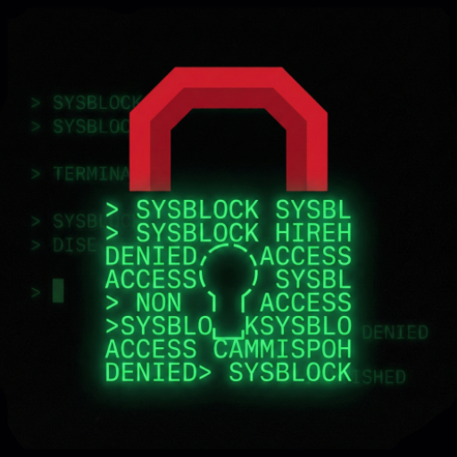

# SysBlock

SysBlock is a powerful, self-imposed digital wellbeing tool for Android designed to help you regain control of your time. It combines app blocking, usage limits, strict schedules, and focus modes to prevent you from bypassing your own rules.

## Key Features

*   **App Blocking:** Block distracting apps completely or set daily usage limits (e.g., "30m", "1h").
*   **Schedules:** Define specific time ranges (e.g., "Work", "Sleep") when apps are blocked.
*   **Focus Mode ("Deep Work"):** A high-priority mode that blocks everything except a specific set of allowed tools.
*   **Sleep Mode:** Enforce a strict bedtime by blocking apps globally, with support for "Wrap Up" sessions and specific exemptions.
*   **Scroll & Reel Limiter:** Detects and limits doom-scrolling in apps like Instagram Reels, TikTok, and YouTube Shorts.
*   **Master Switch:** A global toggle to enable or disable all blocking rules instantly.
*   **Freeze Protocol:** Lock specific lines of your configuration for set time periods. During this time, you cannot edit or delete those rules.
*   **Uninstall Protection:** Optional Device Admin permission prevents the app from being force-stopped or uninstalled.
*   **Raw Config Editor:** Full control via the text-based `CONFIG.SYS` file.

## Getting Started

### Installation

1.  Download the latest APK from the [Releases](https://github.com/estiaksoyeb/SysBlock-Releases/releases) page.

<p align="left">
        <a href="https://github.com/estiaksoyeb/SysBlock-Releases/releases/download/v4.2.1/SysBlock-v4.2.1.apk">
            
        </a>
</p>

2.  Install the APK on your Android device.
3.  Grant the necessary permissions:
    *   **Accessibility:** Required to detect/block apps and limit scrolling.
    *   **Usage Access:** Required to track daily app usage time.

### Basic Usage

1.  **Home Screen:** View active status and system health. Use the "Master Switch" to toggle protection.
2.  **App Selection:** Tap "Apps" to select apps to block or limit.
3.  **Schedules:** Create reusable time schedules (e.g., Work: 9-5, Mon-Fri).
4.  **Configuration:** Use the **Advanced Editor** to fine-tune rules or the **Package Copier** to find app IDs.
5.  **Learn Config:** Check the built-in guide in the "More" tab to master the `CONFIG.SYS` syntax.

## Configuration Guide

The app behavior is driven by `CONFIG.SYS`. See "Learn Config" in the app for full details.

### Examples

**Block Social Media during Work:**
```text
SET | SCHEDULE | Work | 09:00 17:00 | MON, TUE, WED, THU, FRI
SET | APPLOCK | com.instagram.android | Work
```

**Set a 30 Minute Daily Limit:**
```text
SET | APPLOCK | com.twitter.android | 30m
```

**Sleep Mode (11 PM - 7 AM) with Exemptions:**
```text
SET | PKGSET | SafeApps | com.google.android.deskclock, com.meditation.app
SET | SLEEP_MODE | 23:00 | 8h
SET | IGNORE_SLEEP_MODE | SafeApps
```

**Focus Mode (Deep Work):**
```text
SET | PKGSET | Tools | com.calculator, com.notes
SET | FOCUS | Work | Tools
```

## Developer

**Istiak Ahmmed Soyeb**

*   [Twitter](https://twitter.com/estiaksoyeb)
*   [GitHub](https://github.com/estiaksoyeb)
*   [Telegram](https://t.me/estiaksoyeb)

## Proprietary Software

This project is **Closed Source**. All rights are reserved by the developer. Unauthorized distribution, modification, or reverse engineering is prohibited.